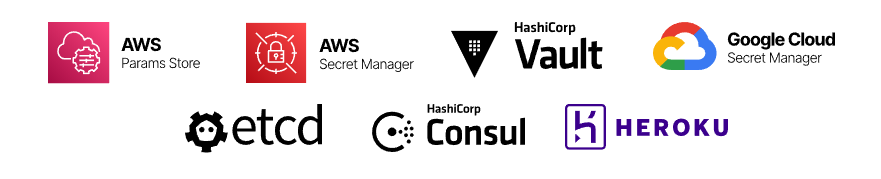

<p align="center">
<br/>
<br/>
<br/>
   
<br/>
<br/>
</p>

<p align="center">
<b>:computer: Never leave your terminal for secrets</b>
<br/>
<b>:pager: Create easy and clean workflows for working with cloud environments</b>
<br/>
<b>:mag_right: Scan for secrets and fight secret sprawl</b>
<br/><br/><br/>
   <a href="https://www.producthunt.com/posts/teller-3?utm_source=badge-featured&utm_medium=badge&utm_souce=badge-teller-3" target="_blank"></a><br/>
<br/><br/><br/>
<hr/>
</p>

<p align="center">


</p>

# Teller - the open-source universal secret manager for developers

Never leave your terminal to use secrets while developing, testing, and building your apps.

Instead of custom scripts, tokens in your `.zshrc` files, visible `EXPORT`s in your bash history, misplaced `.env.production` files and more around your workstation -- just use `teller` and connect it to any vault, key store, or cloud service you like (Teller support Hashicorp Vault, AWS Secrets Manager, Google Secret Manager, and many more).

You can use Teller to tidy your own environment or for your team as a process and best practice.



## Quick Start with `teller` (or `tlr`)

You can install `teller` with homebrew:

```
$ brew tap spectralops/tap && brew install teller
```

You can now use `teller` or `tlr` (if you like shortcuts!) in your terminal.


`teller` will pull variables from your various cloud providers, vaults and others, and will populate your current working session (in various ways!, see more below) so you can work safely and much more productively.

`teller` needs a tellerfile. This is a `.teller.yml` file that lives in your repo, or one that you point teller to with `teller -c your-conf.yml`.

## Using a Github Action

For those using Github Action, you can have a 1-click experience of installing Teller in your CI:

```yaml
- name: Setup Teller
  uses: spectralops/setup-teller@v1
- name: Run a Teller task (show, scan, run, etc.)
  run: teller run [args]
```

For more, check our [setup teller action](https://github.com/marketplace/actions/setup-teller) on the marketplace.

## Create your configuration

Run `teller new` and follow the wizard, pick the providers you like and it will generate a `.teller.yml` for you.

Alternatively, you can use the following minimal template or [view a full example](.teller.example.yml):

```yaml
project: project_name
opts:
  stage: development

# remove if you don't like the prompt
confirm: Are you sure you want to run in {{stage}}?

providers:
  # uses environment vars to configure
  # https://github.com/hashicorp/vault/blob/api/v1.0.4/api/client.go#L28
  hashicorp_vault:
    env_sync:
      path: secret/data/{{stage}}/services/billing

  # this will fuse vars with the below .env file
  # use if you'd like to grab secrets from outside of the project tree
  dotenv:
    env_sync:
      path: ~/billing.env.{{stage}}
```

Now you can just run processes with:

```
$ teller run node src/server.js
Service is up.
Loaded configuration: Mailgun, SMTP
Port: 5050
```

Behind the scenes: `teller` fetched the correct variables, placed those (and _just_ those) in `ENV` for the `node` process to use.

# Best practices

Go and have a look at a collection of our [best practices](./best-practices.md)

# Features

## :running: Running subprocesses

Manually exporting and setting up environment variables for running a process with demo-like / production-like set up?

Got bitten by using `.env.production` and exposing it in the local project itself?

Using `teller` and a `.teller.yml` file that exposes nothing to the prying eyes, you can work fluently and seamlessly with zero risk, also no need for quotes:

```
$ teller run -- your-process arg1 arg2... --switch1 ...
```

## :mag_right: Inspecting variables

This will output the current variables `teller` picks up. Only first 2 letters will be shown from each, of course.

```
$ teller show
```

## :tv: Local shell population

Hardcoding secrets into your shell scripts and dotfiles?

In some cases it makes sense to eval variables into your current shell. For example in your `.zshrc` it makes much more sense to use `teller`, and not hardcode all those into the `.zshrc` file itself.

In this case, this is what you should add:

```
eval "$(teller sh)"
```

## :whale: Easy Docker environment

Tired of grabbing all kinds of variables, setting those up, and worried about these appearing in your shell history as well?

Use this one liner from now on:

```
$ docker run --rm -it --env-file <(teller env) alpine sh
```

## :warning: Scan for secrets

Teller can help you fight secret sprawl and hard coded secrets, as well as be the best productivity tool for working with your vault.

It can also integrate into your CI and serve as a shift-left security tool for your DevSecOps pipeline.

Look for your vault-kept secrets in your code by running:

```
$ teller scan
```

You can run it as a linter in your CI like so:

```
run: teller scan --silent
```

It will break your build if it finds something (returns exit code `1`).

Use Teller for productively and securely running your processes and you get this for free -- nothing to configure. If you have data that you're bringing that you're sure isn't sensitive, flag it in your `teller.yml`:

```
dotenv:
  env:
    FOO:
      path: ~/my-dot-env.env
      severity: none # will skip scanning. possible values: high | medium | low | none
```

By default we treat all entries as sensitive, with value `high`.

## :recycle: Redact secrets from process outputs, logs, and files

You can use `teller` as a redaction tool across your infrastructure, and run processes while redacting their output as well as clean up logs and live tails of logs.

Run a process and redact its output in real time:

```
$ teller run --redact -- your-process arg1 arg2
```

Pipe any process output, tail or logs into teller to redact those, live:

```
$ cat some.log | teller redact
```

It should also work with `tail -f`:

```
$ tail -f /var/log/apache.log | teller redact
```

Finally, if you've got some files you want to redact, you can do that too:

```
$ teller redact --in dirty.csv --out clean.csv
```

If you omit `--in` Teller will take `stdin`, and if you omit `--out` Teller will output to `stdout`.

## :beetle: Detect secrets and value drift

You can detect _secret drift_ by comparing values from different providers against each other. It might be that you want to pin a set of keys in different providers to always be the same value; when they aren't -- that means you have a drift.

In most cases, keys in providers would be similar which we call _mirrored_ providers. Example:

```
Provider1:
  MG_PASS=foo***

Provider2:
  MG_PASS=foo***   # Both keys are called MG_PASS
```

To detected mirror drifts, we use `teller mirror-drift`.

```bash
$ teller mirror-drift --source global-dotenv --target my-dotenv

Drifts detected: 2

changed [] global-dotenv FOO_BAR "n***** != my-dotenv FOO_BAR ne*****
missing [] global-dotenv FB 3***** ??
```

Use `mirror-drift --sync ...` in order to declare that the two providers should represent a completely synchronized mirror (all keys, all values).

As always, the specific provider definitions are in your `teller.yml` file.

## :beetle: Detect secrets and value drift (graph links between providers)

Some times you want to check drift between two providers, and two unrelated keys. For example:

```
Provider1:
  MG_PASS=foo***

Provider2:
  MAILGUN_PASS=foo***
```

This poses a challenge. We need some way to "wire" the keys `MG_PASS` and `MAILGUN_PASS` and declare a relationship of source (`MG_PASS`) and destination, or sink (`MAILGUN_PASS`).

For this, you can label mappings as `source` and couple with the appropriate sink as `sink`, effectively creating a graph of wirings. We call this `graph-drift` (use same label value for both to wire them together). Then, source values will be compared against sink values in your configuration:

```yaml
providers:
  dotenv:
    env_sync:
      path: ~/my-dot-env.env
      source: s1
  dotenv2:
    kind: dotenv
    env_sync:
      path: ~/other-dot-env.env
      sink: s1
```

And run

```
$ teller graph-drift dotenv dotenv2 -c your-config.yml
```


## :scroll: Populate templates

Have a kickstarter project you want to populate quickly with some variables (not secrets though!)?

Have a production project that just _has_ to have a file to read that contains your variables?

You can use `teller` to inject variables into your own templates (based on [go templates](https://golang.org/pkg/text/template/)).

With this template:

```go
Hello, {{.Teller.EnvByKey "FOO_BAR" "default-value" }}!
```

Run:

```
$ teller template my-template.tmpl out.txt
```

Will get you, assuming `FOO_BAR=Spock`:

```
Hello, Spock!
```

## :arrows_counterclockwise: Copy/sync data between providers

In cases where you want to sync between providers, you can do that with `teller copy`.

**Specific mapping key sync**

```bash
$ teller copy --from dotenv1 --to dotenv2,heroku1
```

This will:

1. Grab all mapped values from source (`dotenv1`)
2. For each target provider, find the matching mapped key, and copy the value from source into it

**Full copy sync**

```bash
$ teller copy --sync --from dotenv1 --to dotenv2,heroku1
```

This will:

1. Grab all mapped values from source (`dotenv1`)
2. For each target provider, perform a full copy of values from source into the mapped `env_sync` key

Notes:

- The mapping per provider is as configured in your `teller.yaml` file, in the `env_sync` or `env` properties.
- This sync will try to copy _all_ values from the source.

## :bike: Write and multi-write to providers

Teller providers supporting _write_ use cases which allow writing values _into_ providers.

Remember, for this feature it still revolves around definitions in your `teller.yml` file:

```bash
$ teller put FOO_BAR=$MY_NEW_PASS --providers dotenv -c .teller.write.yml
```

A few notes:

- Values are key-value pair in the format: `key=value` and you can specify multiple pairs at once
- When you're specifying a literal sensitive value, make sure to use an ENV variable so that nothing sensitive is recorded in your history
- The flag `--providers` lets you push to one or more providers at once
- `FOO_BAR` must be a mapped key in your configuration for each provider you want to update

Sometimes you don't have a mapped key in your configuration file and want to perform an ad-hoc write, you can do that with `--path`:

```
$ teller put SMTP_PASS=newpass --path secret/data/foo --providers hashicorp_vault
```

A few notes:

- The pair `SMTP_PASS=newpass` will be pushed to the specified path
- While you can push to multiple providers, please make sure the _path semantics_ are the same

## :x: Delete and multi-delete from providers

Teller providers support _deleting_ values _from_ providers.

This feature revolves around definitions in your `teller.yml` file:

```bash
$ teller delete FOO_BAR --providers dotenv -c .teller.yml
```

A few notes:

- You can specify multiple keys to delete, for example:

  ```bash
  $ teller delete FOO BAR BAZ --providers dotenv
  ```

- The flag `--providers` lets you push to one or more providers at once
- All keys must be a mapped key in your configuration for each provider you want to delete from

Sometimes you don't have a mapped key in your configuration file and want to perform an ad-hoc delete. You can do that with the `--path` flag:

```bash
$ teller delete FOO BAR --path ~/my-env-file.env --providers dotenv
```

You can also delete all keys at once for a given path, without specifying them one by one:

```bash
$ teller delete --all-keys --path ~/my-env-file.env --providers dotenv
```

## :white_check_mark: Prompts and options

There are a few options that you can use:

- **carry_env** - carry the environment from the parent process into the child process. By default we isolate the child process from the parent process. (default: _false_)

- **confirm** - an interactive question to prompt the user before taking action (such as running a process). (default: _empty_)

- **opts** - a dict for our own variable/setting substitution mechanism. For example:

```
opts:
  region: env:AWS_REGION
  stage: qa
```

And now you can use paths like `/{{stage}}/{{region}}/billing-svc` where ever you want (this templating is available for the **confirm** question too).

If you prefix a value with `env:` it will get pulled from your current environment.

## `YAML` Export in YAML format

You can export in a YAML format, suitable for [GCloud](https://cloud.google.com/functions/docs/env-var):

```
$ teller yaml
```

Example format:

```yaml
FOO: "1"
KEY: VALUE
```

## `JSON` Export in JSON format

You can export in a JSON format, suitable for piping through `jq` or other workflows:

```
$ teller json
```

Example format:

```json
{
  "FOO": "1"
}
```

# Providers

For each provider, there are a few points to understand:

- Sync - full sync support. Can we provide a path to a whole environment and have it synced (all keys, all values). Some of the providers support this and some don't.
- Key format - some of the providers expect a path-like key, some env-var like, and some don't care. We'll specify for each.

## General provider configuration

We use the following general structure to specify sync mapping for all providers:

```yaml
# you can use either `env_sync` or `env` or both
env_sync:
  path: ... # path to mapping
  remap:
    PROVIDER_VAR1: VAR3 # Maps PROVIDER_VAR1 to local env var VAR3
env:
  VAR1:
    path: ... # path to value or mapping
    field: <key> # optional: use if path contains a k/v dict
    decrypt: true | false # optional: use if provider supports encryption at the value side
    severity: high | medium | low | none # optional: used for secret scanning, default is high. 'none' means not a secret
    redact_with: "**XXX**" # optional: used as a placeholder swapping the secret with it. default is "**REDACTED**"
  VAR2:
    path: ...
```

### Remapping Provider Variables

Providers which support syncing a list of keys and values can be remapped to different environment variable keys. Typically, when teller syncs paths from `env_sync`, the key returned from the provider is directly mapped to the environment variable key. In some cases it might be necessary to have the provider key mapped to a different variable without changing the provider settings. This can be useful when using `env_sync` for [Hashicorp Vault Dynamic Database credentials](https://www.vaultproject.io/docs/secrets/databases):

```yaml
env_sync:
  path: database/roles/my-role
  remap:
    username: PGUSER
    password: PGPASSWORD
```

Additionally, you can remap key settings by using `remap_with` instead of `remap`:
```yaml
env_sync:
  path: database/roles/my-role
  remap_with: # Use either remap or remap_with, not both.
    username:
      field: PGUSER
      severity: none
    password:
      field: PGPASSWORD
      severity: high
      redact_with: "**XXX**"
```

After remapping, the local environment variable `PGUSER` will contain the provider value for `username` and `PGPASSWORD` will contain the provider value for `password`.

## Hashicorp Vault

### Authentication

If you have the Vault CLI configured and working, there's no special action to take.

Configuration is environment based, as defined by client standard. See variables [here](https://github.com/hashicorp/vault/blob/api/v1.0.4/api/client.go#L28).

### Features

- Sync - `yes`
- Mapping - `yes`
- Modes - `read+write`
- Key format - path based, usually starts with `secret/data/`, and more generically `[engine name]/data`

### Example Config

```yaml
hashicorp_vault:
  env_sync:
    path: secret/data/demo/billing/web/env
  env:
    SMTP_PASS:
      path: secret/data/demo/wordpress
      field: smtp
```

## Consul

### Authentication

If you have the Consul CLI working and configured, there's no special action to take.

Configuration is environment based, as defined by client standard. See variables [here](https://github.com/hashicorp/consul/blob/master/api/api.go#L28).

### Features

- Sync - `yes`
- Mapping - `yes`
- Modes - `read+write`
- Key format
  - `env_sync` - path based, we use the last segment as the variable name
  - `env` - any string, no special requirement

### Example Config

```yaml
consul:
  env_sync:
    path: ops/config
  env:
    SLACK_HOOK:
      path: ops/config/slack
```

## Heroku

### Authentication

Requires an API key populated in your environment in: `HEROKU_API_KEY` (you can fetch it from your ~/.netrc).

Generate new token with Heroku cli: `heroku authorizations:create` then use the TOKEN value.

### Features

- Sync - `yes`
- Mapping - `yes`
- Modes - `read+write`
- Key format
  - `env_sync` - name of your Heroku app
  - `env` - the actual env variable name in your Heroku settings

### Example Config

```yaml
heroku:
  env_sync:
    path: my-app-dev
  env:
    MG_KEY:
      path: my-app-dev
```

## Etcd

### Authentication

If you have `etcdctl` already working there's no special action to take.

We follow how `etcdctl` takes its authentication settings. These environment variables need to be populated

- `ETCDCTL_ENDPOINTS`

For TLS:

- `ETCDCTL_CA_FILE`
- `ETCDCTL_CERT_FILE`
- `ETCDCTL_KEY_FILE`

### Features

- Sync - `yes`
- Mapping - `yes`
- Modes - `read+write`
- Key format
  - `env_sync` - path based
  - `env` - path based

### Example Config

```yaml
etcd:
  env_sync:
    path: /prod/billing-svc
  env:
    MG_KEY:
      path: /prod/billing-svc/vars/mg
```

## AWS Secrets Manager

### Authentication

Your standard `AWS_DEFAULT_REGION`, `AWS_ACCESS_KEY_ID`, `AWS_SECRET_ACCESS_KEY` need to be populated in your environment

### Features

- Sync - `yes`
- Mapping - `yes`
- Modes - `read+write+delete`
- Key format
  - `env_sync` - path based
  - `env` - path based

### Example Config

```yaml
aws_secretsmanager:
  env_sync:
    path: /prod/billing-svc
  env:
    MG_KEY:
      path: /prod/billing-svc/vars/mg
```

## AWS Parameter store

### Authentication

Your standard `AWS_DEFAULT_REGION`, `AWS_ACCESS_KEY_ID`, `AWS_SECRET_ACCESS_KEY` need to be populated in your environment

### Features

- Sync - `no`
- Mapping - `no`
- Modes - `read+write+delete`
- Key format
  - `env` - path based
  - `decrypt` - available in this provider, will use KMS automatically

### Example Config

```yaml
aws_ssm:
  env:
    FOO_BAR:
      path: /prod/billing-svc/vars
      decrypt: true
```

## Google Secret Manager

### Authentication

You should populate `GOOGLE_APPLICATION_CREDENTIALS=account.json` in your environment to your relevant `account.json` that you get from Google.

### Features

- Sync - `yes`
- Mapping - `yes`
- Modes - `read+write+delete`
- Key format
  - `env` - path based, needs to include a version
  - `env_sync` - your project's path (gets the secrets latest version), when using --sync a new secret version will be created
  - `decrypt` - available in this provider, will use KMS automatically

### Example Config

```yaml
google_secretmanager:
  env_sync:
    # secrets version is not relevant here since we are getting the latest version
    path: projects/44882
  env:
    MG_KEY:
      # need to supply the relevant version (versions/1)
      path: projects/44882/secrets/MG_KEY/versions/1
```

if your secrets in google secret manager are stored as JSON or K:V you can add the field property to query the secret body
```yaml
google_secretmanager:
  env_sync:
    # secrets version is not relevant here since we are getting the latest version
    path: projects/44882
  env:
    MG_KEY:
      # need to supply the relevant version (versions/1)
      path: projects/44882/secrets/MG_KEY/versions/1
      field: MG_KEY
```

## .ENV (dotenv)

### Authentication

No need. You'll be pointing to a one or more `.env` files on your disk.

### Features

- Sync - `yes`
- Mapping - `yes`
- Modes - `read+write+delete`
- Key format
  - `env` - env key like

### Example Config

You can mix and match any number of files, sitting anywhere on your drive.

```yaml
dotenv:
  env_sync:
    path: ~/my-dot-env.env
  env:
    MG_KEY:
      path: ~/my-dot-env.env
```

## Doppler

### Authentication

Install the [doppler cli][dopplercli] then run `doppler login`. You'll also need to configure your desired "project" for any given directory using `doppler configure`. Alternatively, you can set a global project by running `doppler configure set project <my-project>` from your home directory.

### Features

- Sync - `yes`
- Mapping - `yes`
- Modes - `read`
- Key format
  - `env` - env key like

### Example Config

```yaml
doppler:
  env_sync:
    path: prd
  env:
    MG_KEY:
      path: prd
      field: OTHER_MG_KEY # (optional)
```

[dopplercli]: https://docs.doppler.com/docs/cli

## Vercel

### Authentication

Requires an API key populated in your environment in: `VERCEL_TOKEN`.

### Features

- Sync - `yes`
- Mapping - `yes`
- Modes - `read`, [write: accepting PR](https://github.com/spectralops/teller)
- Key format
  - `env_sync` - name of your Vercel app
  - `env` - the actual env variable name in your Vercel settings

### Example Config

```yaml
vercel:
  env_sync:
    path: my-app-dev
  env:
    MG_KEY:
      path: my-app-dev
```

## CyberArk Conjur

### Authentication

Requires a username and API key populated in your environment:

- `CONJUR_AUTHN_LOGIN`
- `CONJUR_AUTHN_API_KEY`

Requires a .conjurrc file in your User's home directory:

```yaml
---
account: conjurdemo
plugins: []
appliance_url: https://conjur.example.com
cert_file: ""
```

- `account` is the organization account created during initial deployment
- `plugins` will be blank
- `appliance_url` should be the Base URI for the Conjur service
- `cert_file` should be the public key certificate if running in self-signed mode

### Features

- Sync - `no` [sync: accepting PR](https://github.com/spectralops/teller)
- Mapping - `yes`
- Modes - `read+write`
- Key format
  - `env_sync` - not supported to comply with least-privilege model
  - `env` - the secret variable path in Conjur Secrets Manager

### Example Config

```yaml
cyberark_conjur:
  env:
    DB_USERNAME:
      path: /secrets/prod/pgsql/username
    DB_PASSWORD:
      path: /secrets/prod/pgsql/password
```

## Cloudflare Workers KV

### Authentication

requires the following environment variables to be set:

`CLOUDFLARE_API_KEY`: Your Cloudflare api key.
`CLOUDFLARE_API_EMAIL`: Your email associated with the api key.
`CLOUDFLARE_ACCOUNT_ID`: Your account ID.

### Features

- Sync - `yes`
- Mapping - `yes`
- Modes - `read` (write coming soon)
- Key format
  - `env_sync` - The KV namespace ID
  - `field` - the actual key stored in the KV store
  - `env` - the actual key stored in the KV store

### Example Config

```yaml
opts:
  kv-namespace-id: <YOUR NAMESPACE ID>

providers:
  cloudflare_workers_kv:
    env_sync:
      path: "{{kv-namespace-id}}"
      remap:
        # looks up the key `test_key` and maps it to `TEST`.
        test_key: TEST
    env:
      SOME_SECRET:
        path: "{{kv-namespace-id}}"
        # Accesses the key `SOME_SECRET` in the KV namespace.
      REMAPPED_KEY:
        path: "{{kv-namespace-id}}"
        # Accesses the field `SOME_KEY` in the KV namespace and maps it to REMAPPED_KEY.
        field: SOME_KEY
```

## Cloudflare Workers Secrets

### Usage:

```sh
$ teller put foo-secret=000000  --providers cloudflare_workers_secrets
$ teller put foo-secret=123 foo-secret2=456 --providers cloudflare_workers_secrets --sync # take from env_sync for using the same source for multiple secrets
$ teller delete foo-secret foo-secret2 --providers cloudflare_workers_secrets
```

### Authentication

requires the following environment variables to be set:

`CLOUDFLARE_API_KEY`: Your Cloudflare api key.
`CLOUDFLARE_API_EMAIL`: Your email associated with the api key.
`CLOUDFLARE_ACCOUNT_ID`: Your account ID.

### Features

- Sync - `yes`
- Mapping - `yes`
- Modes - `write`
- Key format
  - `source` - The script name
  - `path` - Name of the secret, when using `--sync` the path will overridden by the given parameters

### Example Config

```yaml
providers:
  cloudflare_workers_secrets:
    env_sync:
      source: script-id
    env:
      foo-secret:
        path: foo-secret
        source: script-id
      foo-secret2:
        path: foo-secret
        source: script-id
```

## 1Password

### Authentication

To integrate with the 1Password API, you should have system-to-system secret management running in your infrastructure/localhost [more details here](https://support.1password.com/connect-deploy-docker/).

Requires the following environment variables to be set:
`OP_CONNECT_HOST` - The hostname of the 1Password Connect API
`OP_CONNECT_TOKEN` - The API token to be used to authenticate the client to a 1Password Connect API.

### Features

- Sync - `no`
- Mapping - `yes`, returns all fields on specific secret item
- Modes - `read+write`
- Key format
  - `env_sync` - Will return all the fields under the secret item.
    - `path` - Mandatory field: Secret item name. (expected unique secret item with the same name)
    - `source` - Mandatory field: vaultUUID to query
  - `env`
    - `path` - Mandatory field: Secret item name. (expected unique secret item with the same name)
    - `source` - Mandatory field: vaultUUID to query
    - `field` - Mandatory field: the specific field name (notesPlain, {custom label name}, password, type etc).

### Example Config

```yaml
1password:
  env_sync:
    path: security-note
    source: VAULT-ID
  env:
    SECURITY_NOTE_TITLE:
      path: security-note-title
      source: VAULT-ID
      field: lable1
    NOTE_SECRET:
      path: login-title
      source: VAULT-ID
      field: password
    CREDIT_CARD:
      path: credit-card-title
      source: VAULT-ID
      field: type
```

### Run Example:

Example:

```sh
OP_CONNECT_HOST="http://localhost:8080" OP_CONNECT_TOKEN=""  teller yaml
```

## Gopass

### Authentication

If you have the Gopass working and configured, there's no special action to take.

Configuration is environment based, as defined by client standard. See variables [here](https://github.com/gopasspw/gopass/blob/master/docs/config.md).

### Features

- Sync - `yes`
- Mapping - `yes`
- Modes - `read+write`
- Key format
  - `env_sync` - path based, we use the last segment as the variable name
  - `env` - any string, no special requirement

### Example Config

```yaml
gopass:
  env_sync:
    path: foo
  env:
    SLACK_HOOK:
      path: path: foo/bar
```

## LastPass

### Authentication

Requires the following environment variables to be set:
`LASTPASS_USERNAME` - LastPass username
`LASTPASS_PASSWORD` - LastPass password

### Features

- Sync - `no`
- Mapping - `no`
- Modes - `read`
- Key format
  - `env_sync` - Will return all the fields under the secret item.
    - `path` - Mandatory field: Secret item ID.
  - `env`
    - `path` - Mandatory field: Secret item ID.
    - `field` - Optional field: by default taking `password` property. in case you want other property un-mark this line and set the LastPass property name.

## GitHub

### Usage:

```sh
$ teller put FROM_TELLER=00000 FROM_TELLER_2=00002 --providers github --sync # Add secrets with dynamic secrets name (take from env_sync)
$ teller put FROM_TELLER=1111 FROM_TELLER_2=222 --providers github # Add defined secrets name from env key (YAML key will be the name of the secret)
$ teller delete FROM_TELLER --providers github # Delete specific secret
$ teller delete FROM_TELLER FROM_TELLER_2 --providers github --all-keys --path={OWNER}/{REPO-NAME} # Delete all repo secrets, limited to 100 secrets per repository
```

### Authentication

requires the following environment variables to be set:

`GITHUB_AUTH_TOKEN`: GitHub token.

### Features

- Sync - `yes`
- Mapping - `yes`
- Modes - `write`
- Key format
  - `path` - Contain the repo owner and the repo name with `/` separator

### Example Config

```yaml
providers:
  github:
    env_sync:
      path: owner/repo-name
    env:
      FROM_TELLER:
        path: owner/repo-name
      FROM_TELLER_2:
        path: owner/repo-name
```

## KeyPass

### Authentication

requires the following environment variables to be set:

`KEYPASS_PASSWORD`: Password database credentials
`KEYPASS_DB_PATH`: Database path

### Features

- Sync - `no`
- Mapping - `yes`
- Modes - `read`

### Example Config

```yaml
providers:
  keypass:
    env_sync:
      path: redis/config
      # source: Optional, all fields is the default. Supported fields: Notes, Title, Password, URL, UserName
    env:
      ETC_DSN:
        path: redis/config/foobar
        # source: Optional, Password is the default. Supported fields: Notes, Title, Password, URL, UserName
```

## FileSystem

Allows to work against filesystem structure. for example:

```
.
└── /folder
    ├── settings/
    │   ├── billing-svc
    │   └── all/
    │       ├── foo
    └── bar
```

### Features

- Sync - `yes`
- Mapping - `yes`
- Modes - `read+write`

### Example Config

```yaml
providers:
  filesystem:
    env_sync:
      path: /folder/settings
    env:
      ETC_DSN:
        path: /folder/bar
```

## ProcessEnv

Load the environment variables from the parent process as needed.

### Authentication

No need.

### Features

- Sync - `yes`
- Mapping - `yes`
- Modes - `read`
- Key format
  - `env_sync` - Will return all the environment variables in the parent process
    - `path` - Value isn't required or used
  - `env`
    - `field` - Optional field: specific environment variable in the parent process

### Example Config

```yaml
providers:
  process_env:
    env:
      ETC_DSN:
        # Optional: accesses the environment variable `SOME_KEY` and maps it to ETC_DSN
        field: SOME_KEY
```

## Azure

### Authentication

Two options for getting Azure authentication are available:

1. Standard Azure [environment variable](https://docs.microsoft.com/en-us/azure/developer/go/azure-sdk-authorization). (Enable by default)
2. For get credentials via [az client](https://docs.microsoft.com/en-us/cli/azure/install-azure-cli) add `AZURE_CLI=1` to your environment variable

Then set your vault-name by specific as environment variable: `KVAULT_NAME`

### Features

- Sync - `yes`
- Mapping - `yes`
- Modes - `read+write+delete`

### Example Config

```yaml
providers:
  azure_keyvault:
    env_sync:
      path: azure
    env:
      FOO:
        path: bar
```

## Keeper Secrets Manager

### Authentication

Configuration is environment based - you should populate `KSM_CONFIG=base64_config` or `KSM_CONFIG_FILE=ksm_config.json` in your environment with a valid [Secrets Manager Configuration](https://docs.keeper.io/secrets-manager/secrets-manager/about/secrets-manager-configuration#creating-a-secrets-manager-configuration). If both environment variables are set then `KSM_CONFIG` is used.

Note:
- _Secrets Manager CLI configuration file format (INI) is different from KSM SDK configuration format (JSON) but the CLI [command](https://docs.keeper.io/secrets-manager/secrets-manager/secrets-manager-command-line-interface/profile-command#export) `ksm profile export profile_name` can be used to export some of the individual profiles into JSON config file compatible with the provider._

### Features

- Sync - `yes`
- Mapping - `yes`
- Modes - `read`
- Key format
  - `env_sync` - path is single record UID. Field labels (if empty -> field types) are used as keys, any duplicates will have a numeric suffix.
  - `env` - any string, conforming to Keeper [Notation](https://docs.keeper.io/secrets-manager/secrets-manager/about/keeper-notation) _(`keeper://` prefix not required)_

### Example Config

```yaml
keeper_secretsmanager:
  env_sync:
    path: ABCDEFGHIJKLMNOPQRSTUV
  env:
    PGUSER:
      path: ABCDEFGHIJKLMNOPQRSTUV/field/login
    CERT:
      path: ABCDEFGHIJKLMNOPQRSTUV/custom_field/ssl_cert
```

# Semantics

## Addressing

- Stores that support key-value interfaces: `path` is the direct location of the value, no need for the `env` key or `field`.
- Stores that support key-valuemap interfaces: `path` is the location of the map, while the `env` key or `field` (if exists) will be used to do the additional final addressing.
- For env-sync (fetching value map out of a store), path will be a direct pointer at the key-valuemap

## Errors

- **Principle of non-recovery**: where possible an error is return when it is not recoverable (nothing to do), but when it is -- providers should attempt recovery (e.g. retry API call)
- **Missing key/value**: it's possible that when trying to fetch value in a provider - it's missing. This is not an error, rather an indication of a missing entry is returned (`EnvEntry#IsFound`)

# Security Model

## Project Practices

- We `vendor` our dependencies and push them to the repo. This creates an immutable, independent build, that's also free from risks of fetching unknown code in CI/release time.

## Providers

For every provider, we are federating all authentication and authorization concern to the system of origin. In other words, if for example you connect to your organization's Hashicorp Vault, we assume you already have a secure way to do that, which is "blessed" by the organization.

In addition, we don't offer any way to specify connection details to these systems in writing (in configuration files or other), and all connection details, to all providers, should be supplied via environment variables.

That allows us to keep two important points:

1. Don't undermine the user's security model and threat modeling for the sake of productivity (security AND productivity CAN be attained)
2. Don't encourage the user to do what we're here for -- save secrets and sensitive details from being forgotten in various places.

## Developer Guide

- [Add new provider](./doc/new-provider.md)
- Quick testing as you code: `make lint && make test`
- Checking your work before PR, run also integration tests: `make integration`

### Testing

Testing is composed of _unit tests_ and _integration tests_. Integration tests are based on _testcontainers_ as well as live sandbox APIs (where containers are not available)

- Unit tests are a mix of pure and mocks based tests, abstracting each provider's interface with a custom _client_
- View [integration tests](/pkg/integration_test)

To run all unit tests without integration:

```
$ make test
```

To run all unit tests including container-based integration:

```
$ make integration
```

To run all unit tests including container and live API based integration (this is effectively **all integration tests**):

```
$ make integration_api
```

Running all tests:

```
$ make test
$ make integration_api
```

### Linting

Linting is treated as a form of testing (using `golangci`, configuration [here](.golangci.yml)), to run:

```
$ make lint
```

### Thanks:

To all [Contributors](https://github.com/spectralops/teller/graphs/contributors) - you make this happen, thanks!

### Code of conduct

Teller follows [CNCF Code of Conduct](https://github.com/cncf/foundation/blob/master/code-of-conduct.md)

# Copyright

Copyright (c) 2021 [@jondot](http://twitter.com/jondot). See [LICENSE](LICENSE.txt) for further details.
